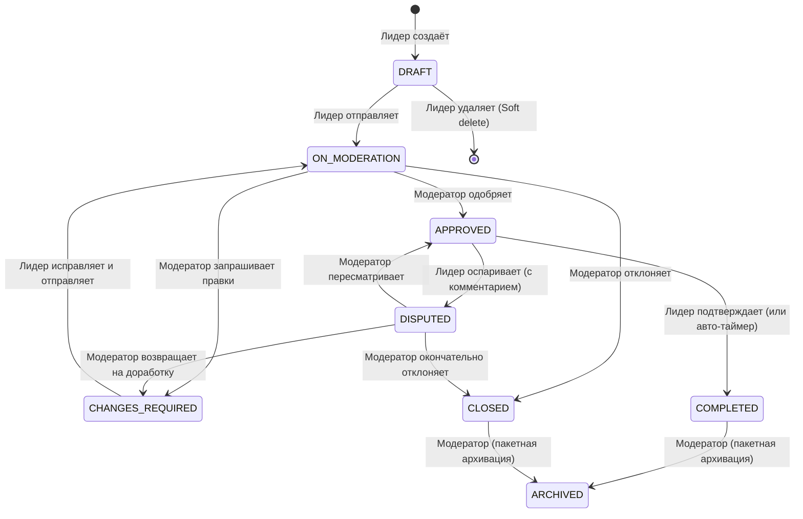
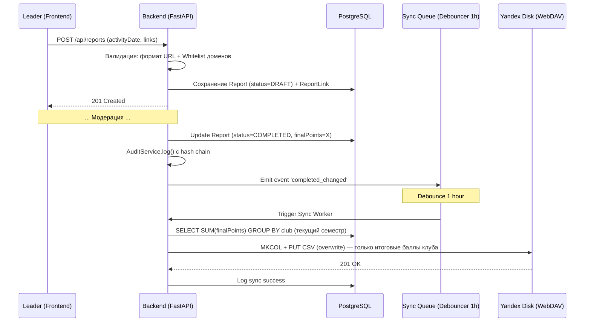
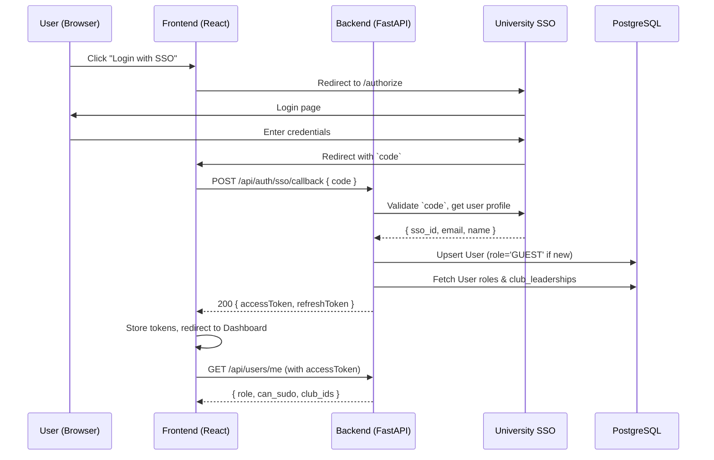

# Архитектурные диаграммы

## 1. State Machine отчёта (8 статусов)

```mermaid
stateDiagram-v2
    [*] --> DRAFT : Лидер создаёт
    DRAFT --> ON_MODERATION : Лидер отправляет
    DRAFT --> [*] : Лидер удаляет (Soft delete)
    
    ON_MODERATION --> CHANGES_REQUIRED : Модератор запрашивает правки
    ON_MODERATION --> APPROVED : Модератор одобряет
    ON_MODERATION --> CLOSED : Модератор отклоняет
    
    CHANGES_REQUIRED --> ON_MODERATION : Лидер исправляет и отправляет
    
    APPROVED --> COMPLETED : Лидер подтверждает (или авто-таймер)
    APPROVED --> DISPUTED : Лидер оспаривает (с комментарием)
    
    DISPUTED --> APPROVED : Модератор пересматривает
    DISPUTED --> CHANGES_REQUIRED : Модератор возвращает на доработку
    DISPUTED --> CLOSED : Модератор окончательно отклоняет
    
    COMPLETED --> ARCHIVED : Модератор (пакетная архивация)
    CLOSED --> ARCHIVED : Модератор (пакетная архивация)
```

## 2. Flow: Подача отчёта и синхронизация рейтинга

```mermaid
sequenceDiagram
    participant L as Leader (Frontend)
    participant BE as Backend (FastAPI)
    participant DB as PostgreSQL
    participant Q as Sync Queue (Debouncer 1h)
    participant Y as Yandex Disk (WebDAV)

    L->>BE: POST /api/reports (activityDate, links)
    BE->>BE: Валидация: формат URL + Whitelist доменов
    BE->>DB: Сохранение Report (status=DRAFT) + ReportLink
    BE-->>L: 201 Created
    
    Note over L,BE: ... Модерация ...
    
    BE->>DB: Update Report (status=COMPLETED, finalPoints=X)
    BE->>BE: AuditService.log() с hash chain
    BE->>Q: Emit event 'completed_changed'
    
    Note over Q: Debounce 1 hour
    
    Q->>BE: Trigger Sync Worker
    BE->>DB: SELECT SUM(finalPoints) GROUP BY club (текущий семестр)
    BE->>Y: MKCOL + PUT CSV (overwrite) — только итоговые баллы клуба
    Y-->>BE: 201 OK
    BE->>DB: Log sync success
```

## 3. Auth Flow (SSO Integration)

```mermaid
sequenceDiagram
    participant U as User (Browser)
    participant FE as Frontend (React)
    participant BE as Backend (FastAPI)
    participant SSO as University SSO
    participant DB as PostgreSQL

    U->>FE: Click "Login with SSO"
    FE->>SSO: Redirect to /authorize
    SSO->>U: Login page
    U->>SSO: Enter credentials
    SSO->>FE: Redirect with `code`
    FE->>BE: POST /api/auth/sso/callback { code }
    BE->>SSO: Validate `code`, get user profile
    SSO-->>BE: { sso_id, email, name }
    BE->>DB: Upsert User (role='GUEST' if new)
    BE->>DB: Fetch User roles & club_leaderships
    BE-->>FE: 200 { accessToken, refreshToken }
    FE->>FE: Store tokens, redirect to Dashboard
    FE->>BE: GET /api/users/me (with accessToken)
    BE-->>FE: { role, can_sudo, club_ids }
```
